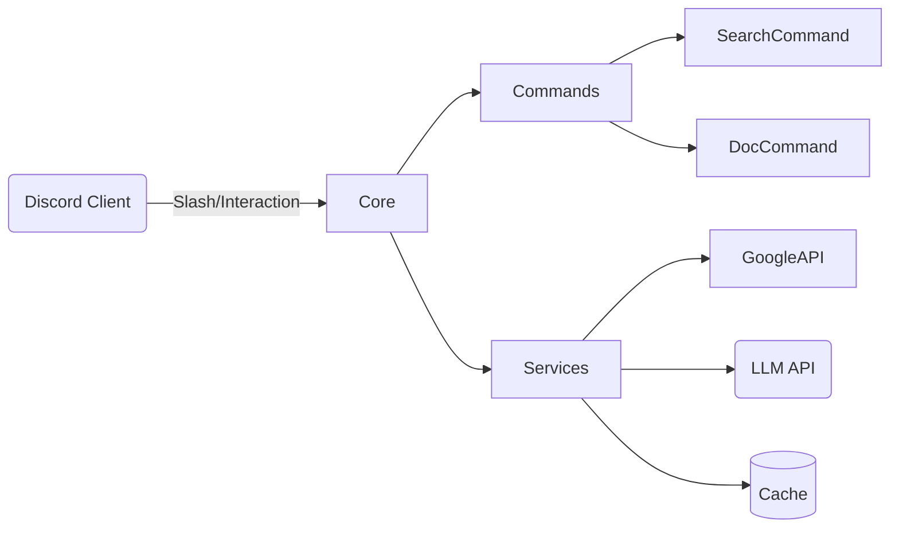
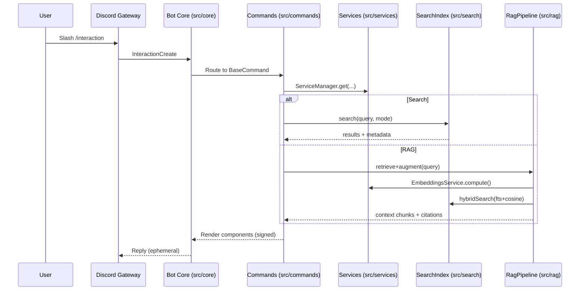

# Архітектура (огляд)

- Повна специфікація: `docs/architecture/ARCHITECTURE.md`
- Дорожня карта: `docs/architecture/ROADMAP.md`
- Модулі команд (історичний документ): `docs/archive/NEW_COMMANDS_ARCHITECTURE.md`

## Карта проєкту



## Системна діаграма (взаємодії)



## Компоненти (мапа каталогів)

- `src/core/` — ядро: `ServiceManager`, `CommandRouter`, життєвий цикл, конфіг.
- `src/commands/` — `BaseCommand`, `SearchCommand`, `DocCommand`, `StatisticsCommand`.
- `src/services/` — `GoogleService`, `EmbeddingsService`, кеш/логер тощо.
- `src/search/` — FTS/SQLite індекс, токенізатор, DDL/міграції.
- `src/rag/` — Retriever/Augmenter/Generator, `RagService`.
- `src/ui/` — побудова карток/кнопок, `signComponentId`.
- `src/tests/` — unit/integration/e2e, сетап моку безпеки.

## Потоки даних: FTS / Embeddings / RAG

```mermaid
flowchart TB
  subgraph Indexing
    A[DriveIndexerService] --> P[Parsers (PDF/DOCX/TXT/Sheets)]
    P --> N[Normalizer]
    N --> SC[segment_cache]
    N --> FTS[SQLite FTS Index]
    N --> EMB[Embeddings (optional)]
  end
  subgraph Retrieval
    Q[Query] -->|FTS| FTS
    Q -->|Cosine| EMB
    FTS & EMB --> HR[Hybrid Retriever (alpha,k)]
  end
  HR --> AUG[Augmenter: select chunks + cite]
  AUG --> GEN[Generator: LLM]
  GEN --> OUT[Answer + Citations]
```

Параметри керуються через `.env` (див. `env.example` та `docs/guides/rag.md`).

## Безпека та i18n

- `signComponentId` з HMAC + TTL для всіх компонентів UI; у тестовому режимі — legacy-сумісність.
- Централізований логер; `no-console` окрім `src/scripts/`.
- Локаль за замовчуванням: `uk` (українська).
