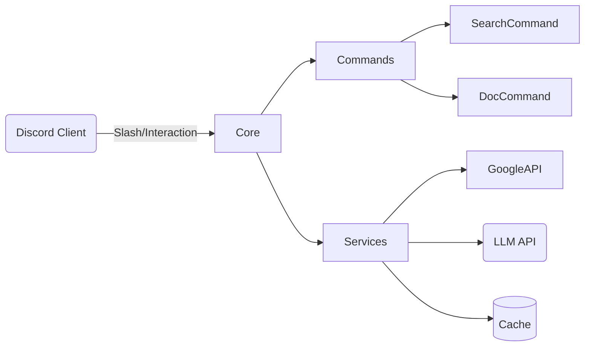

# Архітектура (огляд)

- Повна специфікація: `docs/architecture/ARCHITECTURE.md`
- Дорожня карта: `docs/architecture/ROADMAP.md`
- Модулі команд: `docs/documentation/NEW_COMMANDS_ARCHITECTURE.md`

## Карта проєкту

