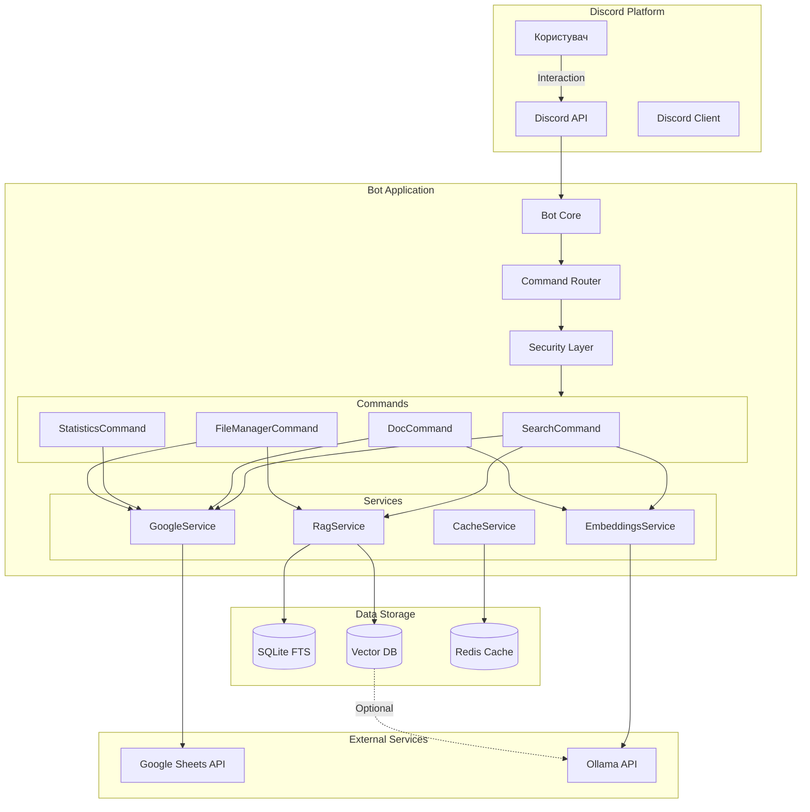
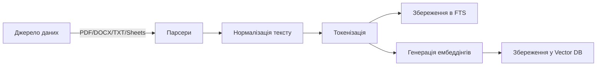
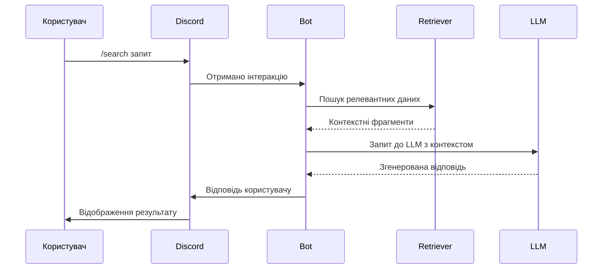

# 🏗️ Архітектура Discord AI Assistant Bot

## 📋 Зміст

- [🗺️ Загальний огляд](#-загальний-огляд)
- [🧩 Ключові компоненти](#-ключові-компоненти)
- [🔄 Потоки даних](#-потоки-даних)
- [⚙️ Технологічний стек](#️-технологічний-стек)
- [🔧 Конфігурація](#-конфігурація)
- [🔐 Безпека](#-безпека)
- [📚 Додаткова документація](#-додаткова-документація)

---

## 🗺️ Загальний огляд

### Діаграма архітектури



### Основні компоненти

1. **Ядро бота (`src/core/`)**
   - `Bot.ts` - головний клас бота, ініціалізація, обробка подій
   - `CommandManager.ts` - реєстрація та управління командами
   - `ServiceContainer.ts` - DI контейнер для сервісів
   - `EventManager.ts` - система подій

2. **Команди (`src/commands/`)**
   - `BaseCommand.ts` - батьківський клас для всіх команд
   - `SearchCommand.ts` - пошук по документах
   - `DocCommand.ts` - управління документами
   - `StatisticsCommand.ts` - статистика використання
   - `FileManagerCommand.ts` - управління файлами

3. **Сервіси (`src/services/`)**
   - `GoogleService.ts` - робота з Google API
   - `EmbeddingsService.ts` - генерація та робота з ембедінгами
   - `RagService.ts` - RAG пайплайн
   - `CacheService.ts` - кешування даних

4. **Пошук (`src/search/`)**
   - `SearchIndex.ts` - інтерфейс пошукового індексу
   - `sqlite/` - реалізація FTS на SQLite
   - `hybrid/` - гібридний пошук (FTS + векторний)

5. **RAG (`src/rag/`)**
   - `Retriever.ts` - пошук релевантних фрагментів
   - `Augmenter.ts` - підготовка контексту
   - `Generator.ts` - генерація відповіді

---

## 🔄 Потоки даних

### Індексація документів



### Обробка запиту



---

## ⚙️ Технологічний стек

### Основні технології
- **Мова**: TypeScript 5.0+
- **Платформа**: Node.js 20.x (LTS)
- **Фреймворк**: Discord.js 14.x
- **База даних**: SQLite3 (FTS5), Redis (кеш)
- **AI/ML**: Ollama (локально), OpenAI API (опційно)
- **Інтеграції**: Google Sheets API

### Бібліотеки
- **DI**: `tsyringe`
- **Валідація**: `zod`
- **Логування**: `winston`
- **Тестування**: `jest`, `supertest`
- **Моніторинг**: Prometheus + Grafana

---

## 🔧 Конфігурація

Основні параметри конфігурації (`.env`):

```env
# Discord
DISCORD_TOKEN=your_token_here
DISCORD_CLIENT_ID=your_client_id

# Google API
GOOGLE_SHEETS_ID=your_sheet_id
GOOGLE_CREDENTIALS_JSON={...}

# AI
AI_PROVIDER=ollama  # або 'openai'
OLLAMA_BASE_URL=http://localhost:11434
OLLAMA_MODEL=llama3

# Пошук
SEARCH_INDEX_PATH=./data/search.db
SEARCH_FTS_TOKENIZER=unicode61
SEARCH_BATCH_SIZE=100

# RAG
RAG_MAX_CONTEXT_TOKENS=4000
RAG_RETRIEVER_K=5
RAG_RETRIEVER_ALPHA=0.5
```

Детальніше: [Гайд з налаштування](guides/SETUP.md)

---

## 🔐 Безпека

### Ключові механізми

1. **Підпис компонентів**
   - Усі кнопки та селектори підписуються через HMAC-SHA256
   - TTL для кожного компоненту (за замовчуванням 15 хв)
   - Відмова у доступі до прострочених компонентів

2. **Робота з даними**
   - PII-маскування у логах
   - Шифрування конфіденційних даних
   - Обмежений доступ до API ключів

3. **Захист API**
   - Rate limiting
   - Валідація вхідних даних
   - Обробка помилок без розголошення деталей

Детальніше: [Керівництво з безпеки](security/SECURITY_GUIDE.md)

---

## 📚 Додаткова документація

- [Швидкий старт](QUICK_START.md) - як швидко почати роботу
- [Гайд з RAG](guides/rag.md) - робота з RAG пайплайном
- [Локальний AI](guides/LOCAL_AI.md) - налаштування Ollama
- [API документація](API_OVERVIEW.md) - опис API бота
- [Розробка](DEVELOPER_GUIDE.md) - гайд для розробників

---

## 🚀 Майбутні вдосконалення

1. Підтримка додаткових векторних БД (Pinecone, Weaviate)
2. Поліпшена обробка таблиць та інших складних форматів
3. Розширена аналітика використання
4. Графічний інтерфейс для налаштувань
5. Додаткові інтеграції з хмарними сховищами

---

> © 2025 Godzilla Bot Team | [Ліцензія MIT](../LICENSE) | [Історія змін](changelog/CHANGELOG.md)
