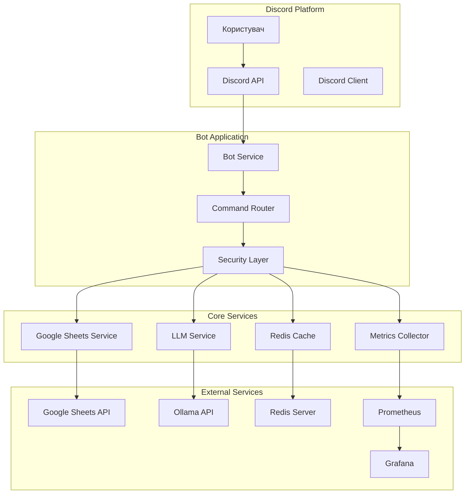
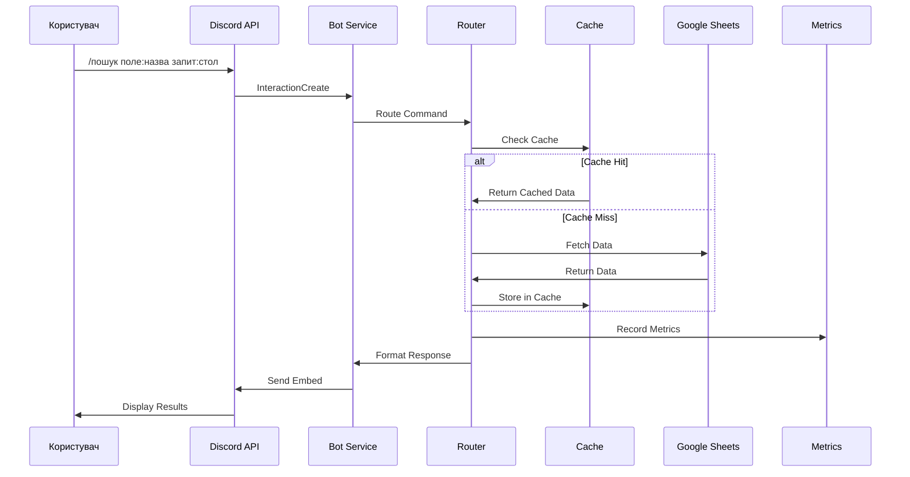
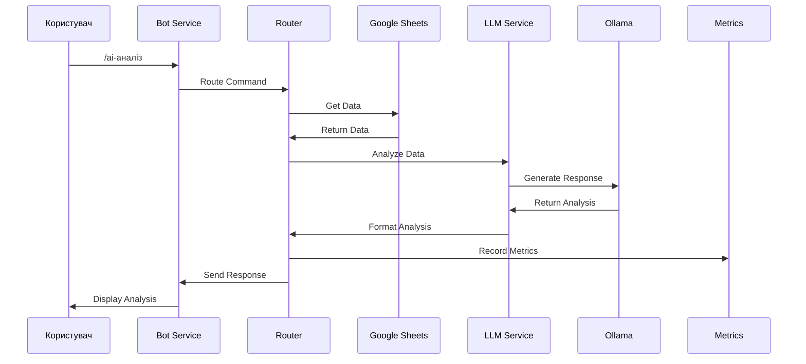
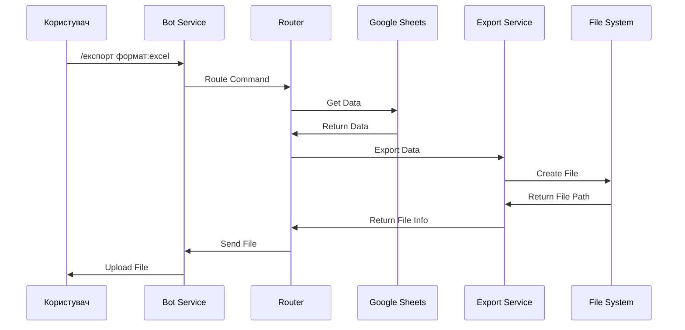

# 🏗️ Архітектура Discord AI Assistant Bot

## 📋 Зміст

- [🗺️ Загальна архітектура](#️-загальна-архітектура)
- [🧩 Ключові компоненти](#-ключові-компоненти)
- [🔄 Потоки даних](#-потоки-даних)
- [⚙️ Технологічний стек](#️-технологічний-стек)
- [🔧 Конфігурація](#-конфігурація)
- [📊 Моніторинг](#-моніторинг)
- [🛡️ Безпека](#-безпека)
- [🚀 Масштабування](#-масштабування)

---

## 🗺️ Загальна архітектура

### Діаграма системи



### Шари архітектури

#### 1. **Presentation Layer** (Шар представлення)
- **Discord.js Client** - взаємодія з Discord API
- **Command Handlers** - обробка slash-команд
- **Message Formatters** - форматування відповідей

#### 2. **Business Logic Layer** (Шар бізнес-логіки)
- **Command Router** - маршрутизація команд
- **Data Processors** - обробка даних
- **AI Services** - AI-аналіз та генерація

#### 3. **Data Access Layer** (Шар доступу до даних)
- **Google Sheets Client** - робота з Google Sheets
- **Redis Client** - кешування
- **LLM Client** - взаємодія з Ollama

#### 4. **Infrastructure Layer** (Інфраструктурний шар)
- **Configuration** - налаштування
- **Logging** - логування
- **Metrics** - метрики
- **Security** - безпека

---

## 🧩 Ключові компоненти

### 1. **Bot Service** (`src/bot.js`)

**Призначення:** Основний сервіс Discord бота

**Функції:**
- Ініціалізація Discord.js клієнта
- Обробка подій Discord
- Управління життєвим циклом бота
- Обробка помилок

**Ключові методи:**
```javascript
class DiscordBot {
  async initialize() // Ініціалізація бота
  async handleInteraction() // Обробка взаємодій
  async handleMessage() // Обробка повідомлень
  async handleError() // Обробка помилок
}
```

### 2. **Command Router** (`src/router.js`)

**Призначення:** Маршрутизація та обробка команд

**Функції:**
- Парсинг slash-команд
- Валідація параметрів
- Направлення до обробників
- Обробка помилок

**Структура команд:**
```javascript
const commands = {
  'залишки': SummaryCommand,
  'пошук': SearchCommand,
  'ai-аналіз': AIAnalysisCommand,
  'експорт': ExportCommand,
  'статистика': StatsCommand
};
```

### 3. **Google Sheets Service** (`src/services/sheets.js`)

**Призначення:** Робота з Google Sheets API

**Функції:**
- Читання даних з таблиць
- Пошук та фільтрація
- Експорт даних
- Кешування результатів

**API методи:**
```javascript
class GoogleSheetsService {
  async getSheetData(range) // Отримання даних
  async searchData(query) // Пошук
  async filterData(filters) // Фільтрація
  async exportData(format) // Експорт
}
```

### 4. **LLM Service** (`src/services/llm.js`)

**Призначення:** Інтеграція з AI моделями

**Функції:**
- Взаємодія з Ollama
- Аналіз даних
- Генерація звітів
- Природномовний пошук

**Моделі:**
```javascript
const LLM_MODELS = {
  'llama3': 'llama3:8b',
  'mistral': 'mistral:7b',
  'gemma': 'gemma:2b'
};
```

### 5. **Cache Service** (`src/services/cache.js`)

**Призначення:** Кешування результатів

**Функції:**
- Зберігання результатів пошуку
- Кешування AI відповідей
- Управління TTL
- Статистика кешу

**Структура кешу:**
```javascript
const CACHE_KEYS = {
  SEARCH: 'search:',
  AI_RESPONSE: 'ai:',
  SHEET_DATA: 'sheet:',
  USER_STATS: 'user:'
};
```

### 6. **Metrics Service** (`src/metrics/prometheus.js`)

**Призначення:** Збір та експорт метрик

**Функції:**
- Збір метрик продуктивності
- Експорт в Prometheus формат
- HTTP сервер для метрик
- Інтеграція з Grafana

**Метрики:**
```javascript
const METRICS = {
  commands_total: 'Кількість команд',
  response_time: 'Час відповіді',
  cache_hits: 'Попадання в кеш',
  errors_total: 'Кількість помилок',
  active_users: 'Активні користувачі'
};
```

---

## 🔄 Потоки даних

### 1. **Обробка команди пошуку**



### 2. **AI-аналіз даних**



### 3. **Експорт даних**



---

## ⚙️ Технологічний стек

### **Frontend (Discord Interface)**
- **Discord.js** - Discord API клієнт
- **EmbedBuilder** - форматування повідомлень
- **ActionRowBuilder** - інтерактивні елементи

### **Backend (Node.js)**
- **Node.js 18+** - JavaScript runtime
- **Express.js** - HTTP сервер для метрик
- **Winston** - логування

### **AI/ML**
- **Ollama** - локальні LLM моделі
- **OpenAI API** - хмарні AI сервіси (опціонально)

### **Бази даних**
- **Google Sheets API** - основні дані
- **Redis** - кешування та сесії

### **Моніторинг**
- **Prometheus** - збір метрик
- **Grafana** - візуалізація
- **prom-client** - Node.js метрики

### **Інфраструктура**
- **Docker** - контейнеризація
- **Docker Compose** - оркестрація
- **GitHub Actions** - CI/CD

---

## 🔧 Конфігурація

### **Environment Variables**

```bash
# Discord Configuration
BOT_TOKEN=your_discord_bot_token
CLIENT_ID=your_discord_client_id
GUILD_ID=your_guild_id

# Google Sheets Configuration
SHEET_ID=your_google_sheet_id
GOOGLE_API_KEY=your_google_api_key
GOOGLE_CREDENTIALS_PATH=./credentials/service-account.json

# AI Configuration
OLLAMA_HOST=http://localhost:11434
OLLAMA_MODEL=llama3:8b
OPENAI_API_KEY=your_openai_api_key

# Cache Configuration
REDIS_URL=redis://localhost:6379
CACHE_TTL=300000

# Metrics Configuration
METRICS_ENABLED=true
METRICS_PORT=3000
METRICS_PATH=/metrics

# Security Configuration
RATE_LIMIT_WINDOW=900000
RATE_LIMIT_MAX=100
ALLOWED_ROLES=admin,moderator
```

### **Configuration Classes**

```javascript
class Config {
  // Discord settings
  discord = {
    token: process.env.BOT_TOKEN,
    clientId: process.env.CLIENT_ID,
    guildId: process.env.GUILD_ID
  };

  // Google Sheets settings
  google = {
    sheetId: process.env.SHEET_ID,
    apiKey: process.env.GOOGLE_API_KEY,
    credentialsPath: process.env.GOOGLE_CREDENTIALS_PATH
  };

  // AI settings
  ai = {
    ollamaHost: process.env.OLLAMA_HOST,
    ollamaModel: process.env.OLLAMA_MODEL,
    openaiKey: process.env.OPENAI_API_KEY
  };

  // Cache settings
  cache = {
    redisUrl: process.env.REDIS_URL,
    ttl: parseInt(process.env.CACHE_TTL)
  };
}
```

---

## 📊 Моніторинг

### **Prometheus Metrics**

```javascript
// Counters
const commandCounter = new Counter({
  name: 'discord_bot_commands_total',
  help: 'Total number of commands',
  labelNames: ['command', 'status', 'user_id']
});

// Histograms
const responseTimeHistogram = new Histogram({
  name: 'discord_bot_response_time_seconds',
  help: 'Response time in seconds',
  buckets: [0.1, 0.5, 1, 2, 5, 10]
});

// Gauges
const activeUsersGauge = new Gauge({
  name: 'discord_bot_active_users',
  help: 'Number of active users'
});
```

### **Grafana Dashboards**

**Основні дашборди:**
1. **Bot Overview** - загальна статистика
2. **Command Performance** - продуктивність команд
3. **Cache Efficiency** - ефективність кешу
4. **Error Monitoring** - моніторинг помилок
5. **User Activity** - активність користувачів

### **Alerting Rules**

```yaml
groups:
  - name: discord_bot_alerts
    rules:
      - alert: HighErrorRate
        expr: rate(discord_bot_errors_total[5m]) > 0.1
        for: 2m
        labels:
          severity: warning
        annotations:
          summary: "High error rate detected"
```

---

## 🛡️ Безпека

### **Authentication & Authorization**

```javascript
class SecurityService {
  // Перевірка ролей Discord
  async checkUserRole(user, requiredRoles) {
    const member = await user.guild.members.fetch(user.id);
    return requiredRoles.some(role => member.roles.cache.has(role));
  }

  // Rate limiting
  async checkRateLimit(userId, command) {
    const key = `rate_limit:${userId}:${command}`;
    const current = await redis.incr(key);
    if (current === 1) {
      await redis.expire(key, config.rateLimit.window);
    }
    return current <= config.rateLimit.max;
  }

  // Валідація вхідних даних
  validateInput(input, schema) {
    return Joi.validate(input, schema);
  }
}
```

### **Data Protection**

- **Шифрування** - всі чутливі дані шифруються
- **Access Control** - контроль доступу на основі ролей
- **Audit Logging** - логування всіх дій
- **Input Sanitization** - очищення вхідних даних

---

## 🚀 Масштабування

### **Horizontal Scaling**

```yaml
# docker-compose.yml для масштабування
services:
  bot:
    image: discord-ai-bot
    deploy:
      replicas: 3
    environment:
      - REDIS_URL=redis://redis:6379
      - OLLAMA_HOST=http://ollama:11434

  redis:
    image: redis:7-alpine
    deploy:
      replicas: 2

  ollama:
    image: ollama/ollama
    deploy:
      replicas: 2
```

### **Load Balancing**

```javascript
// Load balancer для Ollama
class OllamaLoadBalancer {
  constructor(hosts) {
    this.hosts = hosts;
    this.currentIndex = 0;
  }

  getNextHost() {
    const host = this.hosts[this.currentIndex];
    this.currentIndex = (this.currentIndex + 1) % this.hosts.length;
    return host;
  }
}
```

### **Caching Strategy**

```javascript
// Багаторівневе кешування
class MultiLevelCache {
  constructor() {
    this.memoryCache = new Map();
    this.redisCache = new RedisClient();
  }

  async get(key) {
    // Перевірка пам'яті
    if (this.memoryCache.has(key)) {
      return this.memoryCache.get(key);
    }

    // Перевірка Redis
    const redisValue = await this.redisCache.get(key);
    if (redisValue) {
      this.memoryCache.set(key, redisValue);
      return redisValue;
    }

    return null;
  }
}
```

---

## 📈 Продуктивність

### **Optimization Strategies**

1. **Кешування** - Redis для швидких відповідей
2. **Connection Pooling** - пул з'єднань з API
3. **Lazy Loading** - завантаження даних за запитом
4. **Batch Processing** - обробка даних пакетами
5. **Async/Await** - асинхронна обробка

### **Performance Metrics**

```javascript
// Вимірювання продуктивності
const performanceMetrics = {
  responseTime: new Histogram({
    name: 'discord_bot_response_time_seconds',
    help: 'Response time in seconds'
  }),

  memoryUsage: new Gauge({
    name: 'discord_bot_memory_usage_bytes',
    help: 'Memory usage in bytes'
  }),

  cacheHitRate: new Gauge({
    name: 'discord_bot_cache_hit_rate',
    help: 'Cache hit rate percentage'
  })
};
```

---

**🎯 Ця архітектура забезпечує високу продуктивність, масштабованість та надійність Discord AI бота!** 