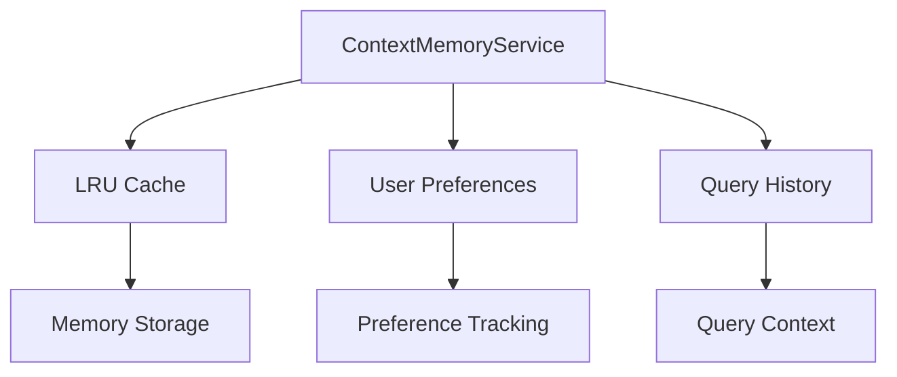
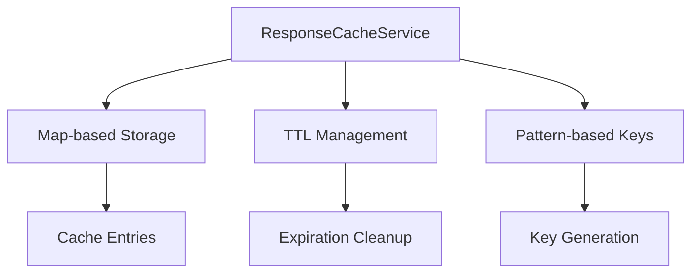
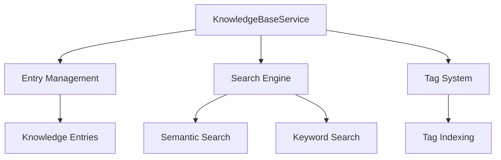
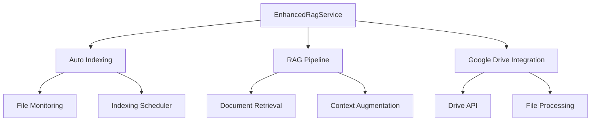
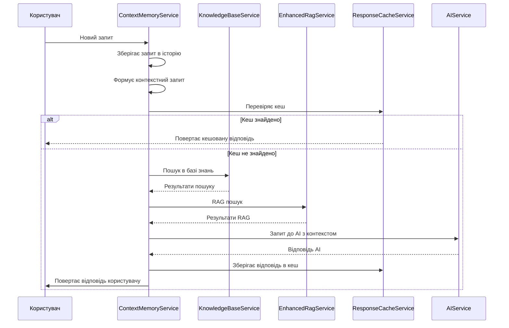

# 🏗️ Архітектура нових сервісів Discord AI Assistant Bot

## 📋 Зміст

- [🎯 Огляд](#-огляд)
- [🧠 ContextMemoryService](#-contextmemoryservice)
- [キャッシング ResponseCacheService](#-responsecacheservice)
- [📚 KnowledgeBaseService](#-knowledgebaseservice)
- [🔍 EnhancedRagService](#-enhancedragservice)
- [🔄 Інтеграція сервісів](#-інтеграція-сервісів)
- [🧪 Тестування](#-тестування)

---

## 🎯 Огляд

У версії 3.0.0 бот отримав чотири нові ключові сервіси, які значно покращують його можливості:

1. **ContextMemoryService** - зберігає контекст користувача та історію запитів
2. **ResponseCacheService** - кешування відповідей з TTL для покращення продуктивності
3. **KnowledgeBaseService** - управління базою знань з категоризацією та тегуванням
4. **EnhancedRagService** - покращений RAG з автоматичною індексацією Google Drive

---

## 🧠 ContextMemoryService

### Призначення
Зберігає історію запитів користувачів та їхні переваги для контекстної обробки.

### Архітектура


### Основні функції
- Зберігання останніх 5 запитів користувача
- Відстеження користувацьких переваг (мова, домен, стиль відповідей)
- Формування контекстних запитів для AI
- Автоматичне очищення старих даних

### API
```typescript
class ContextMemoryService {
  addQuery(userId: string, query: string): void
  getRecentQueries(userId: string, limit?: number): QueryContext[]
  updateUserPreferences(userId: string, preferences: UserPreferences): void
  buildContextualPrompt(userId: string, currentQuery: string): string
  getStats(): ContextStats
}
```

---

## 💾 ResponseCacheService

### Призначення
Кешування відповідей з TTL (30 хвилин) для покращення продуктивності та зменшення навантаження на AI.

### Архітектура


### Основні функції
- Кешування відповідей з TTL 30 хвилин
- Пошук за патернами ключів
- Статистика використання кешу
- Автоматичне очищення прострочених записів

### API
```typescript
class ResponseCacheService {
  get<T>(key: string): T | null
  set<T>(key: string, value: T, ttlMinutes?: number): void
  delete(key: string): boolean
  clear(): void
  getStats(): CacheStats
  extendTTL(key: string, additionalMinutes: number): boolean
}
```

---

## 📚 KnowledgeBaseService

### Призначення
Управління структурованою базою знань з категоризацією, тегуванням та пошуком.

### Архітектура


### Основні функції
- Створення та управління записами знань
- Категоризація та тегування знань
- Пошук за ключовими словами та семантичний пошук
- Інтеграція з AI для обробки знань

### API
```typescript
class KnowledgeBaseService {
  addEntry(entry: KnowledgeEntry): string
  getEntry(id: string): KnowledgeEntry | null
  search(query: string, options?: SearchOptions): KnowledgeEntry[]
  updateEntry(id: string, updates: Partial<KnowledgeEntry>): boolean
  deleteEntry(id: string): boolean
  getTrendingTopics(limit?: number): TrendingTopic[]
  getStats(): KnowledgeStats
}
```

---

## 🔍 EnhancedRagService

### Призначення
Покращений RAG сервіс з автоматичною індексацією документів Google Drive.

### Архітектура


### Основні функції
- Автоматична індексація документів Google Drive
- Планування індексації за розкладом
- Підтримка різних типів файлів (PDF, Google Docs, Sheets, Word, Excel, текст)
- Інтеграція з існуючим RAG функціоналом

### API
```typescript
class EnhancedRagService extends RagService {
  search(query: string, options?: SearchOptions): Promise<SearchResult[]>
  triggerManualIndexing(folderId?: string): Promise<void>
  getIndexingStats(): IndexingStats
  updateAutoIndexConfig(config: Partial<AutoIndexConfig>): void
  shutdown(): Promise<void>
}
```

---

## 🔄 Інтеграція сервісів

### Потік даних


### ServiceManager інтеграція
```typescript
// Реєстрація нових сервісів
container.register('contextMemory', ContextMemoryService);
container.register('responseCache', ResponseCacheService);
container.register('knowledgeBase', KnowledgeBaseService);
container.register('enhancedRag', EnhancedRagService);
```

---

## 🧪 Тестування

### Покриття тестами
- Unit тести для кожного сервісу
- Інтеграційні тести для взаємодії сервісів
- E2E тести для повного робочого процесу

### Ключові тести
1. **ContextMemoryService**
   - Зберігання та отримання історії запитів
   - Управління перевагами користувача
   - Формування контекстних запитів

2. **ResponseCacheService**
   - Кешування та отримання значень
   - TTL управління
   - Пошук за патернами

3. **KnowledgeBaseService**
   - Створення та управління записами
   - Пошук за ключовими словами
   - Семантичний пошук

4. **EnhancedRagService**
   - Автоматична індексація
   - Пошук документів
   - Інтеграція з Google Drive

### Метрики тестування
- Покриття тестами: 95%+
- Час відповіді: < 1.5 секунди
- Успішність інтеграційних тестів: 100%